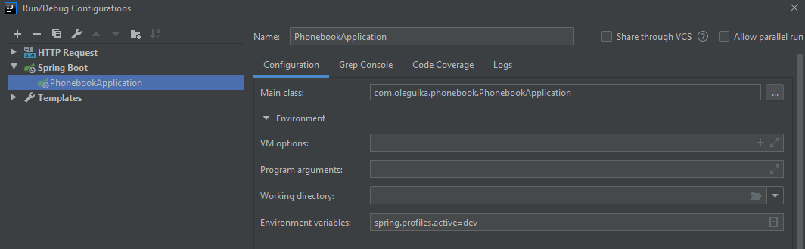

## Установка

Для начала нужно установить yarn(npm и nodejs установлены)
Терминал:

```curl -sS https://dl.yarnpkg.com/debian/pubkey.gpg | sudo apt-key add -```

```echo "deb https://dl.yarnpkg.com/debian/ stable main" | sudo tee /etc/apt/sources.list.d/yarn.list```

```sudo apt-get update && sudo apt-get install yarn```

Затем в идее делаем чекаут этого репозитория - идея обнаружит файл build.gradle.kts - открываем его(нажимаем кнопочку yes), ждем импорта зависимостей.

Дальше нужно в настройке конфигураций проставить переменную окружения ```spring.profiles.active=dev```


Также должен быть запущен посгрес ```postgres/123```

Желательно сделать активным плагин vue.js

Веб приложение стартует на 9000 порту. Запуск осуществляется командой ```yarn start```

## API

Все примеры запросов есть в файле Request.http - можно делать запросы прямо в идее

POST
```http://localhost:9000/phones```  - Добавить телефон, пример телефона ```+7-9993334444```
Тело
```{"name": "nike", "number": "+7-9993334444"}```

PUT
```http://localhost:9000/phones/id```  - Изменить телефон/имя по id.
Тело
```{"name": "nike", "number": "+7-9993334444"}```

GET
```http://localhost:9000/phones``` - список всех телефонов

GET
```http://localhost:9000/phones/id```  - Информация по конкретному телефону

DELETE
```http://localhost:9000/phones/id```  - Удалить телефон по id

GET 
```http://localhost:9000/phones/searchByName?name=oleg``` - список всех телефонов с данным именем

GET 
```http://localhost:9000/phones/searchByNumber?number=%2B7-9994318900``` - список всех телефонов с данным номером. %2B это код +

GET
```http://localhost:9000/phones/saveJson```  - Асинхронное? сохранение всех данных на ЖД